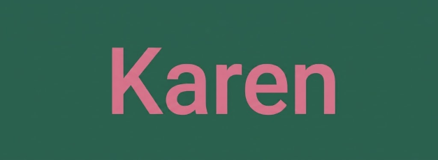

<p align="center">
  
</p>

`karen` manages a git repository: `karen commit` commits the staged diff with a model-written subject, and `karen version` bumps semver and tags `vX.Y.Z` locally (the model picks the bump, or you pass `major`/`minor`/`patch`; push it with `git push origin master --tags`). Uses Anthropic API.

## Setup

Documentation only covers Arch-based systems.

Export Anthropic API key to `~/.bashrc`:

```
export ANTHROPIC_API="<YOUR_API_KEY_GOES_HERE>"
```

Clone the repository and change into its directory.:
```
git clone https://github.com/michaelilgiaev/karen.git && \
cd karen
```

Install:
```
sudo pacman --sync --refresh --needed --noconfirm - < packages_x86_64 && \
bash compile.sh && \ 
sudo install -m 755 output/karen /usr/bin/ && \ 
sudo install -m 644 libraries/completion.bash /usr/share/bash-completion/completions/karen
```
